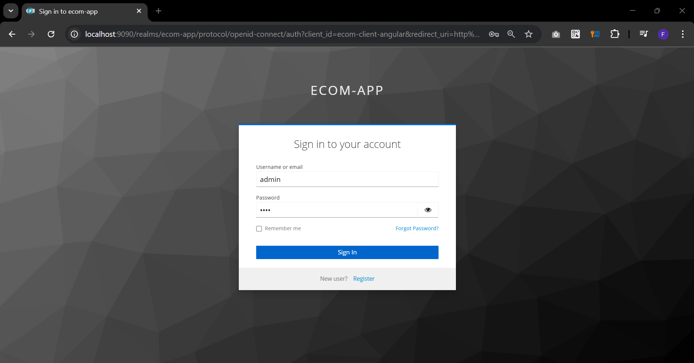

# SPRING CLOUD APPLICATION WITH OAUTH2 KEYCLOAK AND ANGULAR

## Keycloak interfaces :

### Client:

### User:

### Roles:

## Angular interfaces :

### Login Admin:

### List Products:

### List Orders:

### Order Details:
